# The stop-rules demo graphic



The graphic shows one agent turn in a small TypeScript project: the agent adds `src/user.ts`
with a direct `fetch`, a catch that drops the error and a TODO stub, and ends its turn. The
stop hook cuts the change into pieces, asks Jev about each of the project's three rules, and
hands back three findings with their scores. The agent rewrites the code with the project's
`httpGet` helper, and the same check comes back clean.

A still version for places that do not play animation is
[`stop-rules-demo.png`](stop-rules-demo.png), the five beats stacked.

## What is real and what is scripted

- **Real:** the project, the rules, the findings and scores in beat 3, the clean result in
  beat 5, and the timings in beat 4. All of it came from the live Jev service on 22 September
  2026, which reported its version as `jev-1.13.0`, using stop-rules 0.1.0 from this
  repository.
- **Scripted:** the agent's two turns. The broken change is
  [`agent-change.diff`](agent-change.diff) and the repair is [`agent-fix.diff`](agent-fix.diff),
  both written by hand and applied with `git apply`. We gave the same task to Claude Code
  (Sonnet) once, in a copy of this project with the hook installed: it read `src/http.ts`
  and the rules, wrote a `loadUser` that calls `httpGet` from the start, and the hook found
  nothing. That is the usual outcome when the code to copy is right there, so the broken turn
  here is staged to show what a finding looks like.

## The findings

All three are on the one piece the change was cut into, `src/user.ts` lines 1-21. The bar is
the default, 0.6.

| Rule | Score in the graphic | Range over 5 runs | After the repair |
|---|---|---|---|
| No stubs, placeholders or TODO implementations | 0.96 | 0.96 to 0.96 | 0.10 |
| Never call `fetch` directly, use `httpGet` or `httpDelete` | 0.94 | 0.93 to 0.94 | 0.06 |
| Do not silently swallow errors | 0.88 | 0.84 to 0.88 | 0.07 |

The graphic names each rule in a few words so it reads at a glance. The full wording is in
[`project/.stop-rules.md`](project/.stop-rules.md), and this is the report the check printed
on run 3, the median run, which is what the agent is handed. The diff of the piece follows it
in the real output and is left off here.

```
stop-rules: 3 rule violations in 1 place in your latest changes. Jev saw 25 lines around it.
Fix each one. If a rule truly should not apply here, leave the code and tell the user why.

1. src/user.ts lines 1-21 breaks 3 rules
   Rule: Do not leave stubs, placeholders, TODO implementations or fake data in code that is presented as finished. The break is a function that returns a canned value or throws "not implemented", a TODO where the real code should be, or sample data wired in as if it were real. A test double inside a test file is not covered, and an interface or type with no body is not a stub.
   Confidence: 0.96
   Rule: Never call `fetch` directly. Use `httpGet` or `httpDelete` from `src/http.ts`, which add the auth header, the timeout and the retry. The only file allowed to call `fetch` is `src/http.ts` itself. A test may call `fetch` against a server the test starts.
   Confidence: 0.94
   Rule: Do not silently swallow errors. When code catches or receives an error it must rethrow it, return it to the caller, log it with enough context to debug, or store it on a result or record the caller can read. The break is a catch that drops the error and carries on as if nothing happened: an empty catch block, a catch that only says "ignore", or a top-level catch that exits without saying what failed. A test that catches an error it expects, to assert on it, is not covered.
   Confidence: 0.88
```

The graphic also shortens the code: beat 1 shows the lines of `src/user.ts` that break a rule
and beat 5 the lines that changed. The whole files are the two diffs.

## The latency

Wall time of `node .stop-rules/stop-rules.mjs check` on the broken change, five runs, each
with the answer cache deleted first so every run made one real request to Jev. One warm-up run
before them was not counted. Measured on one Mac with Node 22.23.2.

| Run | 1 | 2 | 3 | 4 | 5 |
|---|---|---|---|---|---|
| Seconds | 0.540 | 0.605 | 0.533 | 0.499 | 0.490 |

The median is 0.533 s, and that is the number beat 4 lands on. The timer in the graphic runs
at real speed. This is the time for the check itself. In Claude Code the hook runs in the
background and the agent is woken with the report, so the time until the agent reads it also
includes Claude Code's own step, which we did not measure.

## Run it yourself

You need Node 20 or newer, git, and a Jev key from TypeSafe. From the root of this clone:

```bash
demo=$(mktemp -d)
cp -R examples/demo/project/. "$demo/"
git -C "$demo" init -q && git -C "$demo" add -A && git -C "$demo" commit -qm project
node bin/stop-rules.mjs init --dir "$demo" --agents claude-code
git -C "$demo" add -A && git -C "$demo" commit -qm "install stop-rules"

git -C "$demo" apply "$PWD/examples/demo/agent-change.diff"
(cd "$demo" && node .stop-rules/stop-rules.mjs check); echo "exit $?"   # 3 findings, exit 2

git -C "$demo" apply "$PWD/examples/demo/agent-fix.diff"
(cd "$demo" && node .stop-rules/stop-rules.mjs check); echo "exit $?"   # clean, exit 0
```

Set `TYPESAFE_API_KEY` or `TYPESAFE_API_KEY_FILE` first, or store the key once with
`stop-rules login --jev-key-stdin`. Use `score` in place of `check` to see every rule's score,
including the ones under the bar.

To time it the way beat 4 was timed, with the broken change applied:

```bash
cd "$demo"
for i in 0 1 2 3 4 5; do
  rm -f .git/stop-rules/cache.json
  time node .stop-rules/stop-rules.mjs check > /dev/null
done
```

Scores move a little between runs and between Jev versions, so yours will not be exactly these.

## Files

| File | What it is |
|---|---|
| `stop-rules-demo.svg` | the animated graphic, five beats in a 32 second loop, light and dark |
| `stop-rules-demo.png` | the same five beats stacked, as a still image |
| `stop-rules-demo-static.svg` | the source of that PNG |
| `project/` | the small TypeScript project: `src/http.ts` holds `httpGet` and `httpDelete`, `src/team.ts` uses them |
| `project/.stop-rules.md` | the three rules |
| `agent-change.diff` | the scripted agent turn that adds `src/user.ts` and breaks all three rules |
| `agent-fix.diff` | the scripted repair |
